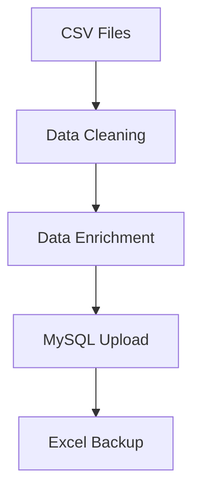

# Activity Log Pipeline 🛠️

 
 


A production-ready data pipeline that seamlessly switches between Python and MySQL for activity log analysis.

## 📋 Requirements
```python
# Core Dependencies
pandas
numpy
datetime
sqlalchemy
mysql-connector-python
openpyxl
```
## 🚀 Key Features
- ✅ Modular, professional code architecture
- ✅ Python-to-SQL seamless integration
- ✅ One-click execution: `python main.py`
- ✅ Maintainable and extensible design

## 🔍 What This Project Does
1. **Extract** contract data from multiple CSV files
2. **Transform**:
   - Clean and sanitize fields
   - Standardize formats and correct dates
3. **Enrich**:
   - Derive warranty status
   - Apply customer segmentation
4. **Load**:
   - Save local Excel backup
   - Upload to MySQL (`Upya_Activity_Log` table)
5. **Maintain**:
   - Remove old records to prevent duplicates


## 🔄 Pipeline Workflow
1. **A** Read CSV files from directory  
2. **B** Filter unwanted entries  
3. **C** Clean and standardize fields  
4. **D** Create new calculated fields  
5. **E** Connect to MySQL database  
6. **F** Delete outdated records  
7. **G** Insert clean data  
8. **H** Merge with external tables  
9. **I** Final calculations  
10. **J** Standardize column order  
11. **K** Generate Excel backup  

## 🛠️ Technologies
| Component | Technology |
|-----------|------------|
| Language | Python 3.8+ |
| Data Processing | Pandas |
| Database ORM | SQLAlchemy |
| MySQL Driver | mysql-connector-python |
| Excel Support | openpyxl |

## ⚠️ Important Notes
- Ensure `Activity_Log` table exists before running  
- Verify CSV files match expected schema  
- **Always backup database before production runs** 🛡️  

## 🚀 Future Improvements
```python
# Planned Enhancements
- Implement proper logging system
- Add robust error handling
- Build CI/CD pipeline
- Develop unit test suite
- Add data validation checks
```
## 🛠️ Installation & Usage
```
# Clone repository
git clone https://github.com/yourusername/activity-log-pipeline.git

# Install dependencies
pip install -r requirements.txt

# Run pipeline
python main.py
```
## 🤝 Contribution
Pull requests welcome! For major changes, please open an issue first.
## 🙌 Author
**Olawale Falodun**  
[](https://www.linkedin.com/in/olawale-falodun)
